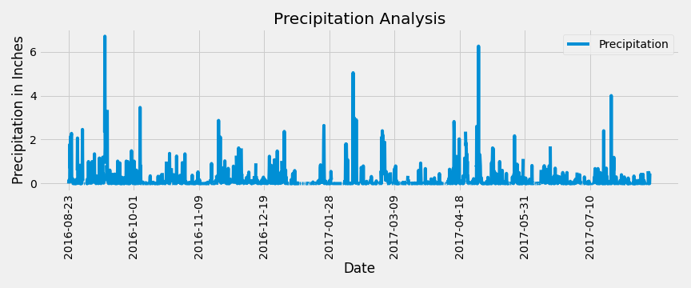
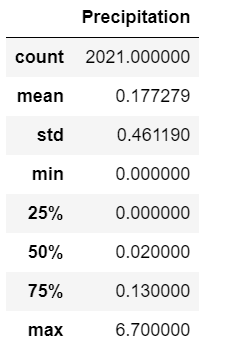
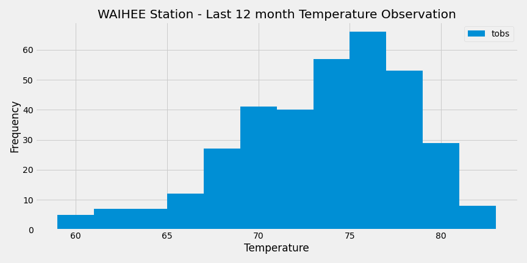
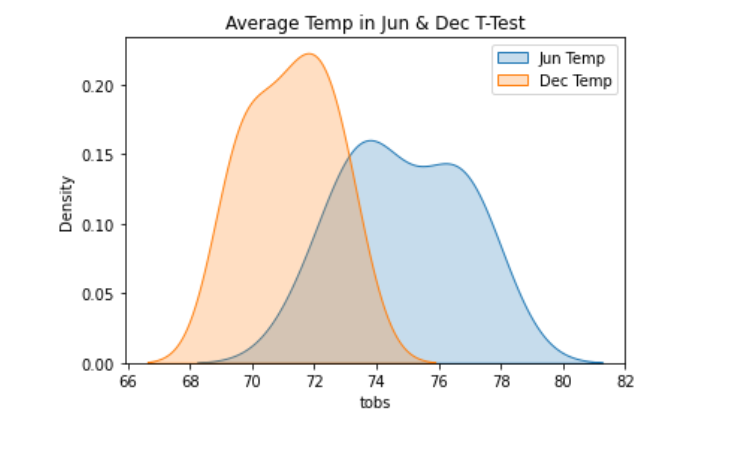
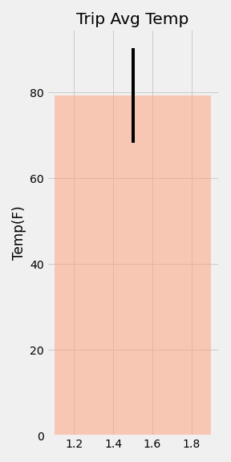
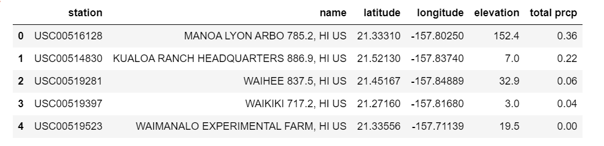
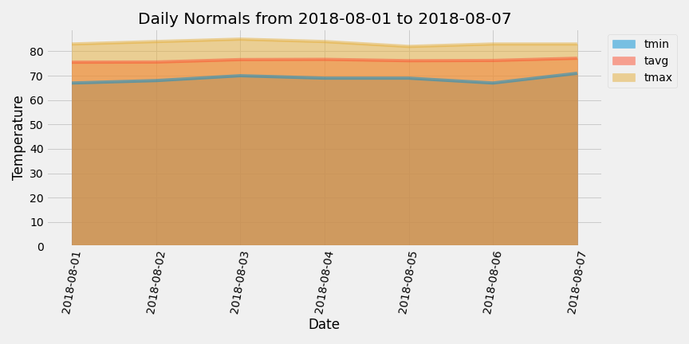

# sqlalchemy-challenge: Surf’s Up

This assignment involved analysing and exploring Hawaii's climate data in 2 parts:

    - Climate Analysis and Exploration
    - Design of Climate App

### Initial tasks performed

1. Created a new repository for this project called `sqlalchemy-challenge`. 

2. Cloned the new repository to my computer.

3. Added my Jupyter notebook and `app.py` to this folder. These will be the main scripts to run for analysis.

4. Pushed the changes to GitHub.

## Part 1: Climate Analysis and Exploration

In this section, Python and SQLAlchemy were used to perform the basic climate analysis and data exploration of the given climate database. All of the analysis was completed by using SQLAlchemy ORM queries, Pandas, and Matplotlib.

* Used the provided [starter notebook](climate_starter.ipynb) and [hawaii.sqlite](Resources/hawaii.sqlite) files to complete this climate analysis and data exploration.

* Used SQLAlchemy’s `create_engine` to connect to the SQLite database.

* Used SQLAlchemy’s `automap_base()` to reflect the given tables into classes and saved a reference to those classes called `Station` and `Measurement`.

* Linked Python to the database by creating a SQLAlchemy session.

* Finally closed out the session at the end of the notebook.

### Precipitation Analysis

The following tasks were performed to do the analysis of precipitation in the area:

* Found the most recent date in the dataset.

* Using this date, retrieved the previous 12 months of precipitation data by querying the 12 previous months of data. 

* Selected only the `date` and `prcp` values.

* Loaded the query results into a Pandas DataFrame, and set the index to the date column.

* Sorted the DataFrame values by `date`.

* Plotted the results by using the DataFrame `plot` method, as shown in the following image:

  

* Used Pandas to print the summary statistics for the precipitation data.

  

### Station Analysis

The following tasks were performed to do the analysis of stations in the area:

* Designed a query to calculate the total number of stations in the dataset.

* Designed a query to find the most active stations (the stations with the most rows).

    * Listed the stations and observation counts in descending order.

    * Printed the station id that has the highest number of observations

    * Using the most active station id, calculated the lowest, highest, and average temperatures.

        ** Used functions such as `func.min`, `func.max`, `func.avg`, and `func.count` in the queries.

* Designed a query to retrieve the previous 12 months of temperature observation data (TOBS).

    * Filtered by the station with the highest number of observations.

    * Queried the previous 12 months of temperature observation data for this station.

    * Plotted the results as a histogram with `bins=12`. Here is the output:

    

* Finally closed out the session.

- - -

## Part 2: Design of Climate App

After completing the initial analysis, designed a Flask API based on the queries that were developed.

Used Flask to create the following routes:

* `/`

    * Homepage.

    * Listed all available routes.

* `/api/v1.0/precipitation`

    * Converted the query results to a dictionary using `date` as the key and `prcp` as the value.

    * Returned the JSON representation of the dictionary.

* `/api/v1.0/stations`

    * Returned a JSON list of stations from the dataset.

* `/api/v1.0/tobs`

    * Queried the dates and temperature observations of the most active station for the previous year of data.

    * Returned a JSON list of temperature observations (TOBS) for the previous year.

* `/api/v1.0/<start>` and `/api/v1.0/<start>/<end>`

    * Returned a JSON list of the minimum temperature, the average temperature, and the maximum temperature for a given start or start-end range.

    * When given the start only, calculated `TMIN`, `TAVG`, and `TMAX` for all dates greater than or equal to the start date.

    * When given the start and the end date, calculated the `TMIN`, `TAVG`, and `TMAX` for dates from the start date through the end date (inclusive).

### Notes

* The station and measurement tables were joined for some of the queries.

* Used Flask `jsonify` to convert the API data into a valid JSON response object.

## Bonus Challenges

* Used the provided [temp_analysis_bonus_1_starter.ipynb](temp_analysis_bonus_1_starter.ipynb) and [temp_analysis_bonus_2_starter.ipynb](temp_analysis_bonus_2_starter.ipynb) starter notebooks for their respective bonus challenges.

### Temperature Analysis 1

This analyis is to find if there is a meaningful difference between the temperatures in June and December months in Hawaii.

* Used Pandas to perform the following steps:

    * Converted the date column format from `string` to `datetime`.

    * Set the date column as the DataFrame index.

    * Dropped the date column.

* Identified the average temperature in June at all stations across all available years in the dataset. Did the same for the temperature in December.

* Used the t-test to determine whether the difference in means, if any, is statistically significant. 

### Analysis:

A paired t-test was used as we are comparing the mean temperatures for the same set of stations.

`Hypothesis:` 
H0: It signifies that the mean June and December temperatures for stations are equal 
HA: It signifies that the mean June and December temperatures for stations are not equal

Since the `p-value (0.00012) is less than 0.05`, we reject the null hypothesis that the mean for June and December temperatures are same. We have statistically sufficient evidence to say that the true mean temperature for stations is different in June and December months.

 

### Temperature Analysis 2

The vacation trip dates are from `August 1 to August 7` of this year. Using the historical data in the dataset, found out what the temperature has previously been for this timeframe.

**Note:** The starter notebook contained a function called `calc_temps` that will accept a start date and end date in the format `%Y-%m-%d`. The function will return the minimum, average, and maximum temperatures for that range of dates.

Completed the following steps:

* Used the `calc_temps` function to calculate the minimum, average, and maximum temperatures for the trip using the matching dates from a previous year (for example, used "2017-08-01").

* Ploted the minimum, average, and maximum temperature from the previous query as a bar chart, as captured in the following steps and image:

    * Used "Trip Avg Temp" as the title.

    * Used the average temperature as the bar height (_y_ value).

    * Used the peak-to-peak (TMAX-TMIN) value as the _y_ error bar (YERR).

    

### Daily Rainfall Average

Then foiund out what the rainfall has been. Completed the following steps:

* Calculated the rainfall per weather station using the previous year's matching dates.

    * Sorted this in descending order by precipitation amount, and lised the station, name, latitude, longitude, and elevation. Here is the output of the DataFrame:
    

### Daily Temperature Normals

Calculated the daily normals for the duration of the trip. Normals are the averages for the minimum, average, and maximum temperatures.

The function called `daily_normals` will calculate the daily normals for a specific date. This date string will be in the format `%m-%d`. 

Completed the following steps:

* Set the start and end date of the trip.

* Used the date to create a range of dates.

* Strip off the year, and saved a list of strings in the format `%m-%d`.

* Used the `daily_normals` function to calculate the normals for each date string, and appended the results to a list called `normals`.

* Loaded the list of daily normals into a Pandas DataFrame, and set the index equal to the date.

* Used Pandas to plot an area plot (`stacked=False`) for the daily normals. Here is the output:

  

* Finally closed out the session.

## Deliverables

Below listed four files are available in `sqlalchemy-challenge` folder.
  
  * Created `climate_starter` Jupyter Notebook for Part-1 challenge.
  * Created `app.py` python file for Part-2 challenge.
  * Created `temp_analysis_bonus_1_starter`Jupyter Notebook Bonus-1 challenge.
  * Created `temp_analysis_bonus_2_starter` Jupyter Notebook for the Bonus-2 challenge.

* All `.png` files are available in `ssqlalchemy-challenge\Images` folder.
* `hawaii.sqlite`and 2 csv files are available in `ssqlalchemy-challenge\Resources` folder.
 
**Created and uploaded the repository with the above files to GitHub and posted a link on BootCamp Spot.

**Ensured that the repository has regular commits and a thorough README.md file